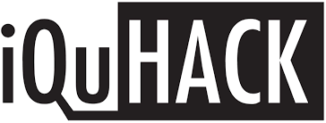
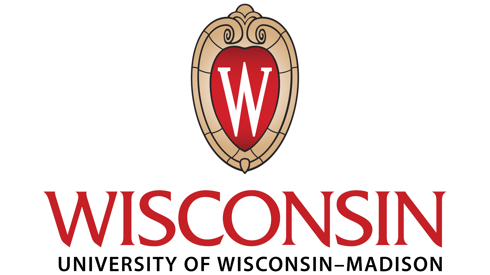
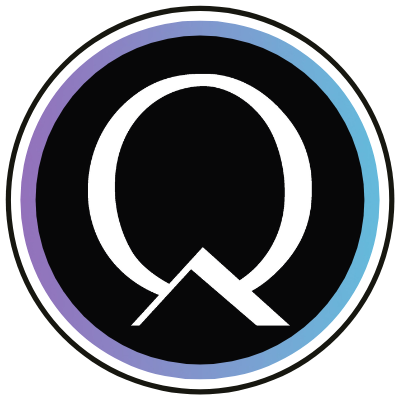
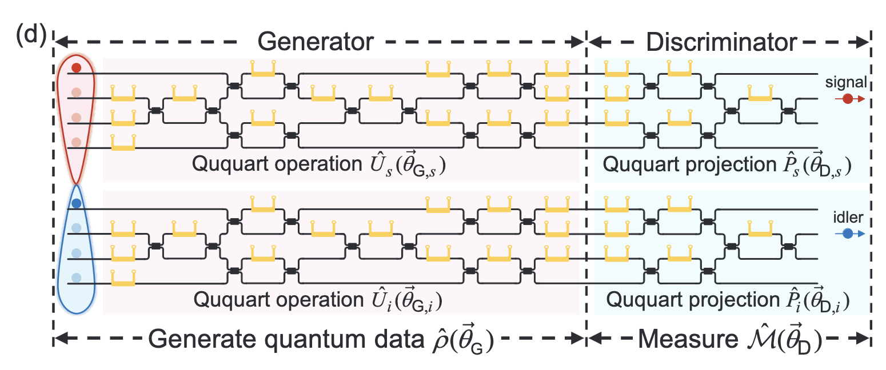
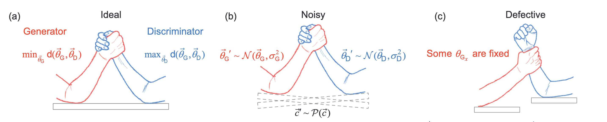
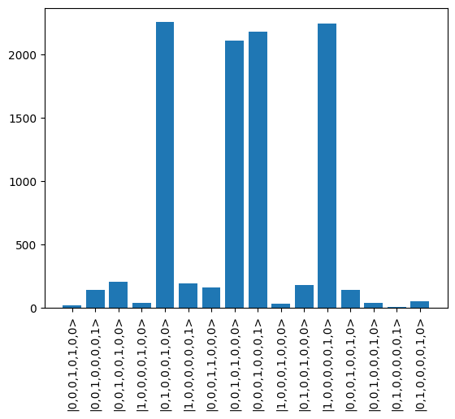
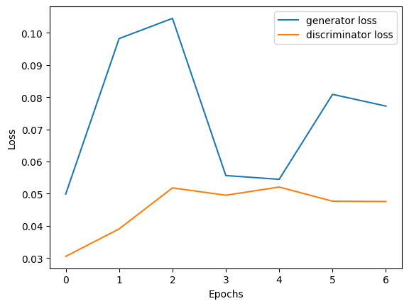
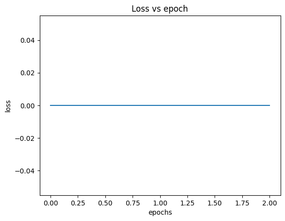

  

# Quantum Generative Adversarial Networks (QGANs) with Quandela's Perceval

---

Quandela Challenge - Team 5 (BiQer Mice from Mars) Members: [Dhanvi Bharadwaj](https://github.com/d-bharadwaj/), [Kshitij Duraphe](https://github.com/ksd3/), [Nico Salm](https://github.com/nicosalm/), [Sarannya Bhattacharya](https://github.com/Emperor963/), [Vinay Swamik](https://github.com/vinayswamik/).

  
  
  

---

## Contents
- [Quantum Generative Adversarial Networks (QGANs) with Quandela's Perceval](#quantum-generative-adversarial-networks-qgans-with-quandelas-perceval)
  - [Contents](#contents)
  - [Theoretical Motivation](#theoretical-motivation)
  - [Step 1: Assembling our Perceval circuit from Figure 1.d](#step-1-assembling-our-perceval-circuit-from-figure-1d)
  - [Step 2: Generate Initial Quantum State](#step-2-generate-initial-quantum-state)
  - [Step 3: Train the Q-GAN](#step-3-train-the-q-gan)
  - [A comparison of approaches](#a-comparison-of-approaches)
      - [The Secant Descent](#the-secant-descent)
      - [The Vectorized Approach](#the-vectorized-approach)
  - [Bonus no. 1!](#bonus-no-1)
  - [Bonus no. 2!](#bonus-no-2)
  - [Bonus no. 3!](#bonus-no-3)
  - [Graphs](#graphs)
  - [Results](#results)
  - [Sources](#sources)
  - [Acknowledgments](#acknowledgments)

## Theoretical Motivation

QGANs represent the convergence of quantum computing and machine learning, offering novel possibilities for quantum state generation Demonstrating in partnership with [Quandela](https://www.quandela.com/)'s [Perceval](https://perceval.quandela.net/) framework, we work to leverage QGANs to capitalize on photon advantage. This implementation showcases precise quantum state control, vital for quantum computing applications. It connects theoretical research with practical experimentation, aiding quantum machine learning and [quantum photonics](https://en.wikipedia.org/wiki/Integrated_quantum_photonics) practitioners.

In summary, this work showcases QGANs' practicality in quantum photonics, advances quantum state engineering, and serves as a foundation for future quantum machine learning research, bridging theory with real-world applications.

## Step 1: Assembling our Perceval circuit from Figure 1.d
First things first! – We assemble our circuit. We are given GANs as a learning architecture and must describe a bi-ququartite circuit using Perceval as described in [1].  

  

In particular, we build and pit a Generator against a Discriminator against one another, in an attempt to approach a Nash equilibrium. We compose these two components as our "chip".

  

<small>(a – d), [1]</small>

## Step 2: Generate Initial Quantum State

It is important to note that we must toss aside our understanding of the traditional Qubit when working with quantum photonics. 

## Step 3: Train the Q-GAN

We tried three approaches, each with varying degrees of success, to training the QGAN.

## A comparison of approaches
#### The Secant Descent
This is a classical approach to optimizing the paramaters of the generator and discriminator using a novel loss function and varying the weights (in this case the phase shift values) using the secant line for fast and accurate calculations. Then we allow the discriminator and the generator play several games until we reach a Nash Equilibrium. We ran several tests and optimized the model over hyperparameters to obtain the periodically oscillating loss as one expects from the adversarial learning of the two models. The loss function is as follows:

1. We propagate the initial state through the generator circuit using the SLOS backend. Because of the SLOS backend, we can sample the first output - and regardless of what it is, we can propagate the output through the discriminator circuit without explicit measurement.
2. We then compute the difference between the probabilities that the |22> state was obtained when the initial state and the true state were propagated through the circuit, and this difference is the loss.

To optimize the loss, we use a modified version of the secant method. We give a user-defined parameter _h_ and compute (loss_function(parameters+h)-loss_function(parameters-h))/2h that approximates the slope of the secant. We then put this slope as the gradient in a _modified secant+gradient descent_ optimizer, where the updates to the weight vectors are chosen uniformly randomly from the range (-learningrate x slope, learningrate x slope). We iterate this for user-defined epochs.

As the results in the paper only show 6 cycles for the generator-discriminator cycle, we show the first 6 epochs of the outer cycle (this is not to be confused with the epochs for the gradient descent cycle).

We obtained a rather low fidelity of 32%, which varies because the initialization of the parameters is completely random.

#### The Vectorized Approach

This is a rather different approach at optimizing the game strategy of the generator and the discriminator. If we assume both of these neural nets to be functions/operators by the universal approximation theorem, we can assume the input state to be a vector, and the output to be the desired maximally entangled state $(|01> + |12> + |23> + |30>)$. Then the idea is to minimize a loss function defined using the dot product(desired vector output, generator output) - 1. This strategy results in very clean results, as shown in the Results section, but seems to be stuck in false minima that prevents it from training to the best and required output from the Generator. 

#### Finite-Difference Gradient Descent Approach

This was our initial approach. Given an arbitrary function **F**, we can approximate its derivatives by performing automatic differentiation (such as PyTorch's grad()). However, as we have no backpropagation defined, we cannot successfully perform backpropagation. We then created a finite-difference method that approximated the derivative using the definition of the derivative. To optimize, we utilized stochastic gradient descent. Our observations were that the loss went to 0 in the second iteration. We suspect that we are overfitting the model but could not successfully resolve the error even after using learning rates in the range of 1e-8. 

## Bonus no. 1!

## Bonus no. 2!

## Bonus no. 3!

## Graphs
Following is a demonstration of the high confidence output of vectorized QGAN

  

This is the loss obtained by the secant-descent method.

  

  

## Results

Fidelity from Secant Descent = 32%

Fidelity from Vectorized QGAN = 45%

Fidelity from Finite-Difference Solver - 28%

## Sources

1. [Quantum generative adversarial learning in photonics](https://arxiv.org/pdf/2310.00585.pdf) [Paper]

2. [Information about Quandela's iQuHack2024 challenge](https://github.com/iQuHACK/2024_Quandela) [Challenge repo]

3. [Quandela Perceval framework](https://perceval.quandela.net/)

## Acknowledgments

***A special thanks to everyone on the Quandela team for their support!***
